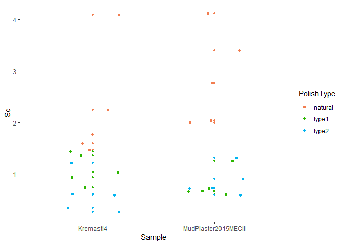
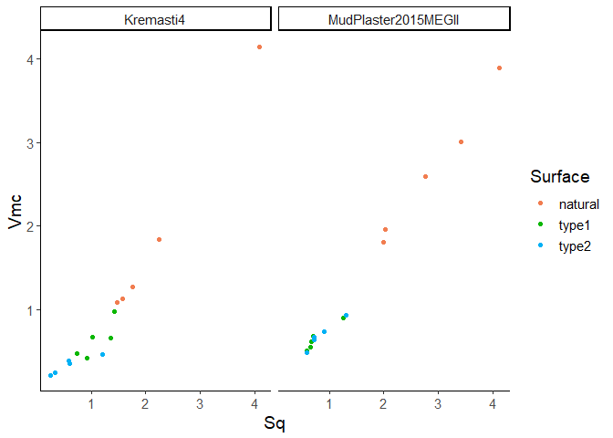

Plots
================
Joao Marreiros
2021-04-22 14:21:48

-   [Load packages](#load-packages)
-   [Get name, path and information of the
    file](#get-name-path-and-information-of-the-file)
-   [Load data into R object](#load-data-into-r-object)
-   [Prepare variables](#prepare-variables)
    -   [Define numeric variables](#define-numeric-variables)
-   [Plot each of the selected numeric
    variables](#plot-each-of-the-selected-numeric-variables)
    -   [Plot just original samples/surfaces organized by
        parameter](#plot-just-original-samplessurfaces-organized-by-parameter)
    -   [Scatterplots of selected variables combined with Sample.ID and
        Polish
        type](#scatterplots-of-selected-variables-combined-with-sampleid-and-polish-type)
        -   [Sa vs. Sq](#sa-vs-sq)
        -   [Sq vs. Vmc](#sq-vs-vmc)
        -   [Mean depth of furrows vs. mean density of
            furrows](#mean-depth-of-furrows-vs-mean-density-of-furrows)
-   [sessionInfo() and RStudio
    version](#sessioninfo-and-rstudio-version)

**Brief description of the script**

This R markdown document plots the data of the resulting CSV file from
the computing ISO 25178-2 parameters in ConfoMap. These data is part of
the manuscript: *Dubreuil et al. A ‘family of wear’: Exploring use-wear
patterns on ad hoc burnishing tools*

This R project and respective scripts follow the procedures described by
Marwick et al. 2017.

The authors would like to thank Ivan Calandra and Lisa Schunk for their
help and contribution on several chunks of code included here in the
script (pieces of code are also adapated from Calandra et al. 2019,
Pedergnana et al. 2020a, 2020b).

To compile this markdown document do not delete or move files from their
original folders.

For any questions, comments and inputs, please contact:

Joao Marreiros, <marreiros@rgzm.de>

------------------------------------------------------------------------

# Load packages

``` r
library(R.utils)
library(ggplot2)
library(tools)
library(tidyverse)
library(wesanderson)

dir_in <- "analysis/derived_data/"
dir_out <- "analysis/plots"
```

------------------------------------------------------------------------

# Get name, path and information of the file

``` r
data_file <- list.files(dir_in, pattern = "\\.Rbin$", full.names = TRUE)
md5_in <- md5sum(data_file)
```

# Load data into R object

``` r
imp_data <- loadObject(data_file)
str(imp_data)
```

    'data.frame':   30 obs. of  53 variables:
     $ Sample.ID               : chr  "Kremasti4" "Kremasti4" "Kremasti4" "Kremasti4" ...
     $ Microscope              : chr  "LSM" "LSM" "LSM" "LSM" ...
     $ Objective               : chr  "50x" "50x" "50x" "50x" ...
     $ PolishType              : chr  "natural" "natural" "natural" "natural" ...
     $ Surface                 : chr  "a" "b" "c" "d" ...
     $ Topo                    : chr  "Topo" "Topo" "Topo" "Topo" ...
     $ Acquisition.Date        : chr  "2021/04/15" "2021/04/15" "2021/04/15" "2021/04/15" ...
     $ Analysis.Date           : chr  "14:06:02" "14:08:39" "14:11:12" "14:13:40" ...
     $ Analysis.Time           : chr  "4/15/2021 10:24:41 AM" "4/15/2021 10:51:24 AM" "4/15/2021 11:45:47 AM" "4/15/2021 12:01:50 PM" ...
     $ Axis.length.X           : num  255 255 255 255 255 ...
     $ Axis.size.X             : num  3000 3000 3000 3000 3000 3000 3000 3000 3000 3000 ...
     $ Axis.spacing.X          : num  85.2 85.2 85.2 85.2 85.2 ...
     $ Axis.length.Y           : num  255 255 255 255 255 ...
     $ Axis.size.Y             : num  3000 3000 3000 3000 3000 3000 3000 3000 3000 3000 ...
     $ Axis.spacing.Y          : num  85.2 85.2 85.2 85.2 85.2 ...
     $ Axis.length.Z           : num  40.7 49.9 92.6 31.8 29.3 ...
     $ Axis.size.Z             : num  65532 65532 65531 65532 65531 ...
     $ Axis.spacing.Z          : num  0.621 0.761 1.413 0.485 0.447 ...
     $ NM.points.ratio.Z       : num  0 0 0 0 0 0 0 0 0 0 ...
     $ Sq                      : num  1.58 4.09 1.47 2.24 1.77 ...
     $ Ssk                     : num  -0.61 -0.391 -0.274 -0.049 -0.929 ...
     $ Sku                     : num  4.88 2.53 6.23 3.44 5.87 ...
     $ Sp                      : num  5.47 10.44 5.15 9.02 7.91 ...
     $ Sv                      : num  6.86 12.48 8.2 7.06 8.52 ...
     $ Sz                      : num  12.3 22.9 13.4 16.1 16.4 ...
     $ Sa                      : num  1.13 3.4 1.08 1.77 1.25 ...
     $ Smr                     : num  0.484 0.239 0.604 0.207 0.126 ...
     $ Smc                     : num  1.69 4.56 1.72 2.87 1.66 ...
     $ Sxp                     : num  3.99 9.02 2.67 4.65 4.7 ...
     $ Sal                     : num  19.5 32.4 23.5 30.6 20.7 ...
     $ Str                     : num  0.48 NA NA 0.614 0.813 ...
     $ Std                     : num  42.2 93.2 33 25.3 62 ...
     $ Sdq                     : num  0.383 0.658 0.521 0.403 0.403 ...
     $ Sdr                     : num  6 15.94 8.53 6.73 6.56 ...
     $ Vm                      : num  0.0895 0.1529 0.1057 0.0994 0.0945 ...
     $ Vv                      : num  1.78 4.72 1.82 2.97 1.75 ...
     $ Vmp                     : num  0.0895 0.1529 0.1057 0.0994 0.0945 ...
     $ Vmc                     : num  1.13 4.14 1.09 1.84 1.28 ...
     $ Vvc                     : num  1.5 4.24 1.65 2.68 1.41 ...
     $ Vvv                     : num  0.287 0.478 0.17 0.292 0.343 ...
     $ Maximum.depth.of.furrows: num  7.22 10.88 9.43 6.76 8.68 ...
     $ Mean.depth.of.furrows   : num  1.57 3.13 1.47 1.9 1.54 ...
     $ Mean.density.of.furrows : num  3750 3056 4011 3480 3423 ...
     $ First.direction         : num  89.9772 90.014 45.0229 0.0123 44.9941 ...
     $ Second.direction        : num  45 135 180 26.5 63.5 ...
     $ Third.direction         : num  180 45 33.7 90 90 ...
     $ Texture.isotropy        : num  74 82.7 77.8 90.3 92.3 ...
     $ epLsar                  : num  NA NA NA NA NA NA NA NA NA NA ...
     $ NewEplsar               : num  NA NA NA NA NA NA NA NA NA NA ...
     $ Asfc                    : num  9.93 25.92 17.49 11.21 10.47 ...
     $ Smfc                    : num  6281985 10723090 4628049 7318909 11574299 ...
     $ HAsfc9                  : num  0.539 0.39 1.927 0.603 0.546 ...
     $ HAsfc81                 : num  0.87 0.638 2.369 0.728 0.848 ...

------------------------------------------------------------------------

# Prepare variables

## Define numeric variables

``` r
num.var <- 20:length(imp_data)
```

The following variables will be used:

    [20] Sq
    [21] Ssk
    [22] Sku
    [23] Sp
    [24] Sv
    [25] Sz
    [26] Sa
    [27] Smr
    [28] Smc
    [29] Sxp
    [30] Sal
    [31] Str
    [32] Std
    [33] Sdq
    [34] Sdr
    [35] Vm
    [36] Vv
    [37] Vmp
    [38] Vmc
    [39] Vvc
    [40] Vvv
    [41] Maximum.depth.of.furrows
    [42] Mean.depth.of.furrows
    [43] Mean.density.of.furrows
    [44] First.direction
    [45] Second.direction
    [46] Third.direction
    [47] Texture.isotropy
    [48] epLsar
    [49] NewEplsar
    [50] Asfc
    [51] Smfc
    [52] HAsfc9
    [53] HAsfc81

------------------------------------------------------------------------

# Plot each of the selected numeric variables

## Plot just original samples/surfaces organized by parameter

``` r
for (i in num.var) {
    p <- ggplot(data = imp_data, aes_string(x = "Sample.ID", y = names(imp_data)[i],
                                            colour = "PolishType")) + 
         geom_point(size = 1) +
         geom_jitter(width = 0.25) +  
         theme_classic() +
         labs(colour = "PolishType") +
         labs(x = "Sample", y = gsub("\\.", " ", names(imp_data)[i])) +
         scale_colour_hue(h = c(25,225), limits = levels(imp_data[["Surface"]]))
  print(p)
  
  # saves the plots 
  file_out <- paste0(file_path_sans_ext(info_in[["file"]]), "_plot_",
                       names(imp_data)[i], ".pdf")
    ggsave(filename = file_out, plot = p, path = dir_out, device = "pdf", width = 26,
           height = 21, units = "cm" )
}
```

    Error in sub("([^.]+)\\.[[:alnum:]]+$", "\\1", x): object 'info_in' not found

<!-- -->

## Scatterplots of selected variables combined with Sample.ID and Polish type

### Sa vs. Sq

``` r
#plot
Sa_Sq <- ggplot(data = imp_data) +  
         geom_point(mapping = aes(x = Sa, y = Sq, colour = PolishType)) +
         theme_classic() +
         labs(colour = "Surface") +
         facet_wrap(~ Sample.ID) +
         scale_colour_hue(h = c(25, 230)) 
print(Sa_Sq)
```

<!-- -->

``` r
# saving the plot
file_out <- paste0(file_path_sans_ext(info_in[["file"]]), "_scatterplot_Sa-Sq", ".pdf")
```

    Error in sub("([^.]+)\\.[[:alnum:]]+$", "\\1", x): object 'info_in' not found

``` r
ggsave(filename = file_out, plot = Sa_Sq, path = dir_out, device = "pdf")
```

    Error in force(filename): object 'file_out' not found

### Sq vs. Vmc

``` r
Sq_Vmc <- ggplot(data = imp_data) +  
          geom_point(mapping = aes(x = Sq, y = Vmc, colour = PolishType)) +
          theme_classic() +
          labs(colour = "Surface") +
          facet_wrap(~ Sample.ID) +
          scale_colour_hue(h = c(25, 230))  
print(Sq_Vmc)
```

<!-- -->

``` r
file_out <- paste0(file_path_sans_ext(info_in[["file"]]), "_scatterplot_Sq-Vmc", ".pdf")
```

    Error in sub("([^.]+)\\.[[:alnum:]]+$", "\\1", x): object 'info_in' not found

``` r
ggsave(filename = file_out, plot = Sq_Vmc, path = dir_out, device = "pdf")
```

    Error in force(filename): object 'file_out' not found

### Mean depth of furrows vs. mean density of furrows

``` r
furrows <- ggplot(data = imp_data) +  
           geom_point(mapping = aes(x = Mean.depth.of.furrows, y = Mean.density.of.furrows, colour = PolishType)) +
           theme_classic() +
           labs(colour = "Surface", x = "Mean depth of furrows", y = "Mean density of furrows") +
           facet_wrap(~ Sample.ID) +
           scale_colour_hue(h = c(25, 230))
print(furrows)
```

<!-- -->

``` r
file_out <- paste0(file_path_sans_ext(info_in[["file"]]), "_scatterplot_furrows", ".pdf")
```

    Error in sub("([^.]+)\\.[[:alnum:]]+$", "\\1", x): object 'info_in' not found

``` r
ggsave(filename = file_out, plot = furrows, path = dir_out, device = "pdf")
```

    Error in force(filename): object 'file_out' not found

------------------------------------------------------------------------

# sessionInfo() and RStudio version

``` r
sessionInfo()
```

    R version 4.0.4 (2021-02-15)
    Platform: x86_64-apple-darwin17.0 (64-bit)
    Running under: macOS Catalina 10.15.7

    Matrix products: default
    BLAS:   /Library/Frameworks/R.framework/Versions/4.0/Resources/lib/libRblas.dylib
    LAPACK: /Library/Frameworks/R.framework/Versions/4.0/Resources/lib/libRlapack.dylib

    locale:
    [1] en_US.UTF-8/en_US.UTF-8/en_US.UTF-8/C/en_US.UTF-8/en_US.UTF-8

    attached base packages:
    [1] tools     stats     graphics  grDevices utils     datasets  methods  
    [8] base     

    other attached packages:
     [1] wesanderson_0.3.6 forcats_0.5.1     stringr_1.4.0     dplyr_1.0.5      
     [5] purrr_0.3.4       readr_1.4.0       tidyr_1.1.3       tibble_3.1.1     
     [9] tidyverse_1.3.1   ggplot2_3.3.3     R.utils_2.10.1    R.oo_1.24.0      
    [13] R.methodsS3_1.8.1

    loaded via a namespace (and not attached):
     [1] Rcpp_1.0.6        lubridate_1.7.10  assertthat_0.2.1  rprojroot_2.0.2  
     [5] digest_0.6.27     utf8_1.2.1        R6_2.5.0          cellranger_1.1.0 
     [9] backports_1.2.1   reprex_2.0.0      evaluate_0.14     httr_1.4.2       
    [13] highr_0.9         pillar_1.6.0      rlang_0.4.10      readxl_1.3.1     
    [17] rstudioapi_0.13   jquerylib_0.1.3   rmarkdown_2.7     labeling_0.4.2   
    [21] munsell_0.5.0     broom_0.7.6       compiler_4.0.4    modelr_0.1.8     
    [25] xfun_0.22         pkgconfig_2.0.3   htmltools_0.5.1.1 tidyselect_1.1.0 
    [29] fansi_0.4.2       crayon_1.4.1      dbplyr_2.1.1      withr_2.4.2      
    [33] grid_4.0.4        jsonlite_1.7.2    gtable_0.3.0      lifecycle_1.0.0  
    [37] DBI_1.1.1         magrittr_2.0.1    scales_1.1.1      cli_2.4.0        
    [41] stringi_1.5.3     farver_2.1.0      fs_1.5.0          xml2_1.3.2       
    [45] bslib_0.2.4       ellipsis_0.3.1    generics_0.1.0    vctrs_0.3.7      
    [49] glue_1.4.2        hms_1.0.0         yaml_2.2.1        colorspace_2.0-0 
    [53] rvest_1.0.0       knitr_1.32        haven_2.4.0       sass_0.3.1       
